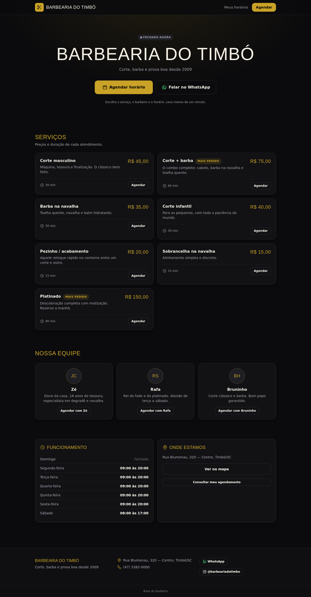
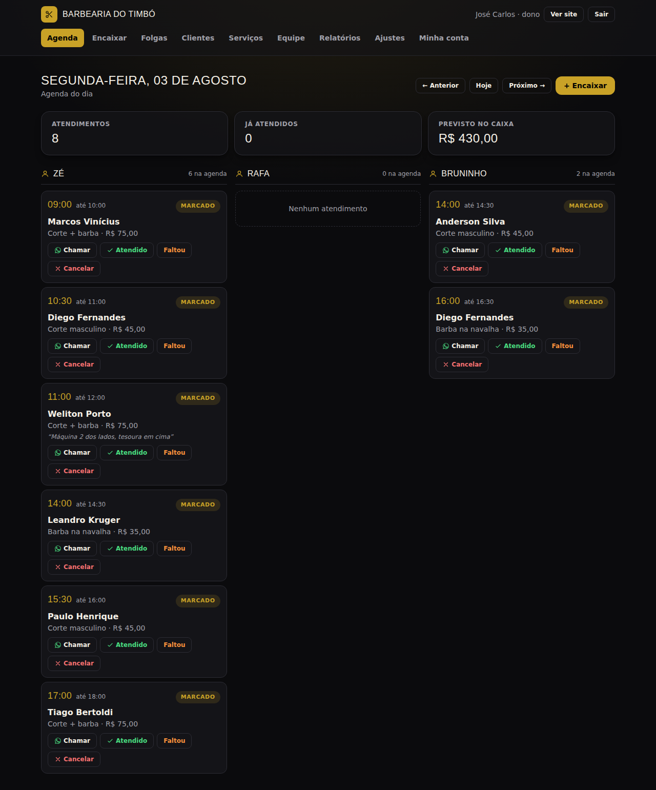
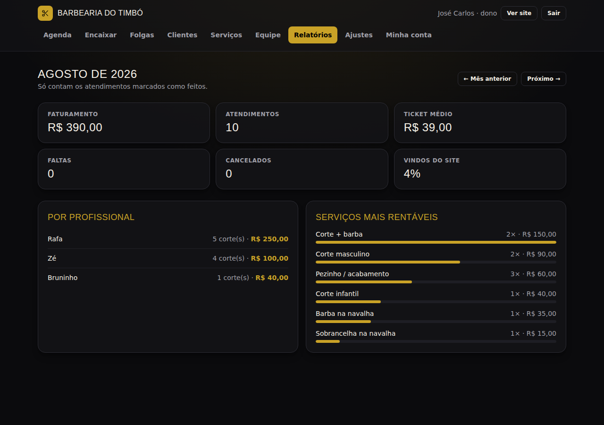

# App de agendamento para barbearia

Sistema de agendamento online com duas partes:

- **Site do cliente** (público): vê serviços, preços, equipe, horários livres e agenda sozinho.
- **Área ADM** (com senha): o barbeiro gerencia a agenda do dia, serviços, equipe, folgas e vê relatórios.

Feito em Next.js + Prisma + PostgreSQL, o mesmo padrão do site da Comissão de Esportes,
para hospedar de graça na Vercel + Supabase.

---

## Telas

| Cliente | ADM |
| --- | --- |
|  |  |
|  |  |

Todas as telas estão em [`docs/telas`](docs/telas).

---

## O que já funciona

### Site do cliente
- Página inicial com serviços (preço e duração), equipe, horário de funcionamento,
  endereço e selo de "aberto/fechado agora".
- Agendamento em 4 passos: **serviço → profissional → dia e horário → nome e WhatsApp**.
  Funciona bem no celular e não exige cadastro nem senha.
- Opção "tanto faz quem atende": mostra os horários livres da casa inteira e distribui
  para o barbeiro com menos serviço no dia.
- Dias sem vaga aparecem apagados no calendário — o cliente não perde tempo clicando.
- Comprovante com link próprio, botão para salvar na agenda do celular (arquivo `.ics`),
  atalho de WhatsApp e cancelamento pelo próprio cliente dentro do prazo configurado.
- Consulta "meus horários" pelo número de WhatsApp, com histórico.

### Área ADM
- **Agenda do dia** em colunas por barbeiro, com navegação por data, total de atendimentos
  e o previsto no caixa. Cada atendimento tem botão de *Atendido*, *Faltou*, *Cancelar*
  e *Chamar no WhatsApp* com mensagem pronta.
- **Encaixar**: cadastro manual de quem ligou ou chegou na porta, com opção de forçar
  sobreposição quando é proposital.
- **Serviços**: nome, descrição, preço, duração, destaque e ativar/desativar.
- **Equipe**: cadastro dos barbeiros, expediente de cada dia da semana (com pausa do almoço)
  e quais serviços cada um faz.
- **Folgas**: bloqueia um período de um barbeiro ou fecha a barbearia inteira (feriado).
- **Clientes**: ficha criada sozinha pelo telefone, com nº de cortes, faltas e total gasto.
- **Relatórios** por mês: faturamento, ticket médio, faltas, cancelamentos, % que veio do site,
  ranking por barbeiro e por serviço.
- **Ajustes**: dados da barbearia e as regras da agenda (intervalo entre horários, antecedência
  mínima, até quantos dias adiante, prazo de cancelamento).
- Dois níveis de acesso: **dono** (vê tudo) e **barbeiro** (só a própria agenda).

### Regras que o sistema garante sozinho
Um horário só aparece para o cliente se passar por tudo isto:

1. o barbeiro tem expediente naquele dia da semana;
2. o serviço cabe inteiro antes do fim do expediente;
3. não invade o intervalo do almoço;
4. não encosta em outro agendamento;
5. não cai em folga/feriado;
6. respeita a antecedência mínima.

Na hora de salvar há uma **segunda conferência no banco**, para dois clientes não
fecharem o mesmo horário ao mesmo tempo.

---

## Rodando na sua máquina

Precisa de Node 20+ e um PostgreSQL (local ou Supabase).

```bash
cd barbearia
npm install
cp .env.example .env      # preencha DATABASE_URL, DIRECT_URL e AUTH_SECRET
npm run db:push           # cria as tabelas
npm run db:seed           # dados de exemplo da "Barbearia do Timbó"
npm run dev               # http://localhost:3000
```

O seed cria dois logins:

| Usuário | Senha | Acesso |
| --- | --- | --- |
| `dono` | `barbearia123` | tudo |
| `rafa` | `rafa123` | só a própria agenda |

**Troque a senha no primeiro acesso** em *ADM → Minha conta*.

Para gerar o `AUTH_SECRET`:

```bash
openssl rand -hex 32
```

---

## Colocando no ar (grátis)

O mesmo caminho do site da Comissão:

1. **Banco** — crie um projeto no [Supabase](https://supabase.com). Em
   *Project Settings → Database → Connection string*, copie as duas strings:
   - `DATABASE_URL` = a de **connection pooling** (porta 6543, com `?pgbouncer=true`);
   - `DIRECT_URL` = a **conexão direta** (porta 5432).
2. **Deploy** — importe o repositório na [Vercel](https://vercel.com) e configure
   *Root Directory* = `barbearia`.
3. **Variáveis de ambiente** na Vercel: `DATABASE_URL`, `DIRECT_URL` e `AUTH_SECRET`.
4. **Criar as tabelas**, uma vez só, com o `.env` apontando para o Supabase:
   ```bash
   npm run db:push
   npm run db:seed
   ```
5. Entre em `/admin`, troque a senha e ajuste serviços, equipe e horários em
   *Ajustes*, *Serviços* e *Equipe*.

Domínio próprio (ex: `barbeariadoseuamigo.com.br`) é só apontar na Vercel;
enquanto isso o endereço `.vercel.app` já funciona.

---

## Ideias para as próximas versões

Ficaram de fora de propósito, para a primeira versão ser simples de usar:

- **Lembrete automático no WhatsApp** um dia antes (precisa da API oficial ou de um
  serviço tipo Z-API / Twilio — tem custo mensal).
- **Fila de espera**: cliente entra na fila de um dia lotado e é avisado se abrir vaga.
- **Sinal/pagamento antecipado** via Pix para serviços caros (reduz falta).
- **Fidelidade**: a cada 10 cortes, um grátis — os dados de visita já são registrados.
- **Comissão por barbeiro** calculada no relatório (% sobre o que cada um fez).
- **Bloqueio de cliente faltante**: quem falta 3 vezes passa a precisar confirmar por telefone.
- **Foto dos profissionais e da barbearia** (hoje aparecem as iniciais).
- **PWA instalável** com ícone na tela inicial do celular.

---

## Estrutura do código

```
barbearia/
├── prisma/
│   ├── schema.prisma        # modelo do banco
│   └── seed.ts              # dados de exemplo
└── src/
    ├── app/
    │   ├── (site)/          # páginas públicas do cliente
    │   ├── admin/           # área do barbeiro (protegida)
    │   ├── api/agenda/      # arquivo .ics do agendamento
    │   └── login/
    ├── components/
    ├── lib/
    │   ├── agenda.ts        # motor dos horários livres
    │   ├── acoes-cliente.ts # ações do site
    │   ├── acoes-admin.ts   # ações do ADM
    │   ├── datas.ts         # datas no fuso de Brasília
    │   ├── auth.ts          # login e permissões
    │   └── config.ts        # ajustes da barbearia
    └── middleware.ts        # protege /admin
```

O arquivo mais importante é `src/lib/agenda.ts`: é ele que decide quais horários
aparecem para o cliente.
